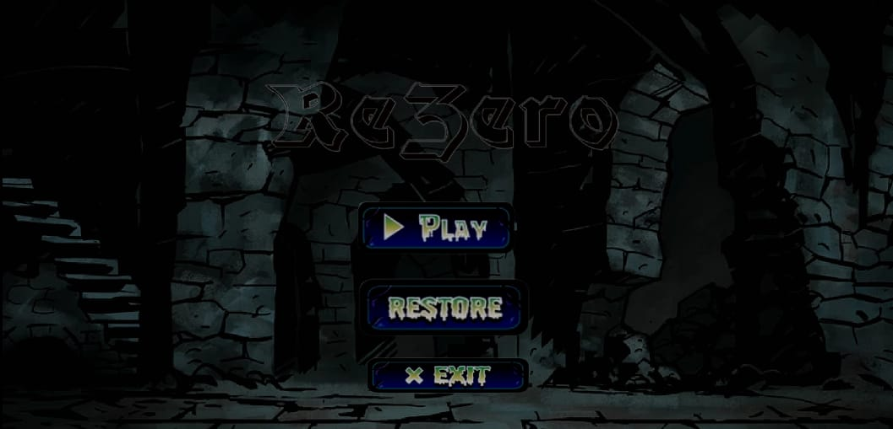

# Google Summer of Code 2024 @ International Catrobat Association

### Awesome Game Demo Project 🎮 

# ⭐🌟⭐ _ReZero: The Rogue-Lite Adventure_ ⭐🌟⭐

## Introduction 
Aim to develop an **awesome rogue-lite action-platformer game** using **Pocket Code**. Playable on both phone and smart TV, _ReZero_ showcases the immense abilities of Pocket Code for designing high-quality games with an engaging and interactive story.

### Aim and Future Objectives 🌍

Catrobat aspires to develop solutions which inspire teenagers and adults to learn coding, get creative, and be prepared for the digital world of our future. We are doing this by bypassing traditional school pedagogy, instead using a constructionist approach focusing on game app development and fun. We believe in poverty alleviation through coding education for teens – girls in particular, refugees, and teens in developing countries, directly on their personal smartphones. This is especially important in less privileged regions, where teenagers have their own smartphones but do not have access to PCs, laptops, or tablets.

## Project Summary 🔮

_ReZero_ is a rogue-lite, Dead Cells-inspired action-platformer, allowing you to explore a sprawling, ever-changing castle… assuming you’re able to fight your way past its keepers. To beat the game, you’ll have to master 2D "souls-lite combat" with the ever-present threat of permadeath looming. Kill, die, learn, repeat. The gameplay will be very similar to Dead Cells with cinematic cutscenes, high-paced action, and magic items.

## Game Story 💞

Explore a fantastical castle filled with all manner of monsters, traps, and treasures. You'll navigate through a variety of environments, mastering their secrets. Every decision, from staying to fleeing or killing to sparing, affects the outcome, making each playthrough unique. The journey is all about learning from each defeat to conquer the castle.

## Features 💬

● **Expansive Levels**: Five major levels, each with unique creatures, traps, and challenges.

● **Cinematic Cutscenes**: Engaging storytelling through beautifully crafted cutscenes.

● **Intense Combat**: 2D "souls-lite combat" mechanics with permadeath, ensuring each encounter is thrilling.

● **Magical Items**: Discover and utilize a variety of magical items to aid in your journey.

● **High-Quality Graphics**: Stunning visuals created with Adobe Photoshop and Logic Pro.

● **Cross-Platform Play**: Available on both phone and smart TV.

## Initial Plan 📈

I chose the Awesome Game Demo Project from the idea list. The project aligned with my skills and interest in designing high-quality games. Pocket Code and Catrobat visual programming language offer powerful tools for developing large-scale gaming projects. The ability to create complex game features with simple blocks of code is particularly exciting. This project allows me to demonstrate the beauty and potential of Pocket Code, motivating enthusiastic developers to explore this field.

## Overall Experience 🏆

Spending my summer transforming a creative idea into a technical game has been an incredible experience so far. Visual coding languages have revolutionized coding, and this project allowed me to delve into this beautiful field. The journey has been filled with learning, challenges, and fun. I have completed the first half of the project, and I look forward to continuing and completing the rest in the coming weeks.

### Challenges and Learning:

● **Initial Setup**: The initial flow, schedule setting, and documentation were new to me, but sessions from Google and guidance from mentors made the process smooth.

● **Art Creation**: Creating visual assets from scratch was time-consuming but rewarding, enhancing my Photoshop skills.

● **Implementing Realistic Physics and Logic**: Thinking from different perspectives and technical testing improved my game logic.

Steve Jobs said, “The only way to do great work is to love what you do!” With the right guidance and support, this experience was fulfilling. Thank you, mentors Aakash Tyagi and Yash Punia, and the International Catrobat Association for the support. From the initial phase to regular communication, the experience was smooth and enriching.

## Contributing to the Project 🤳🏻

The project files (.catrobat files) created during this summer are uploaded. All assets are available under the :assets: folder. The (.catrobat) file can be imported into your Pocket Code app.

Download the desired project file and remix it as you want!

⭐ **Catrobat community** ⭐

 [ReZero: The Rogue-Lite Adventure](https://share.catrob.at/app/project/3881aba6-2bb6-4a1f-8d64-c81991d9e57a)

 [Project page](https://summerofcode.withgoogle.com/programs/2024/projects/fEq0N7WA)

 [Tushar Banik](https://share.catrob.at/app/user/82505f12-9abb-4a47-8b82-3be95962fd16)

